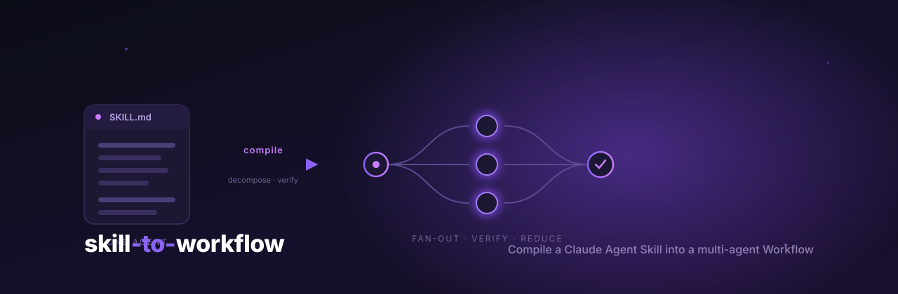

<p align="center">
  
</p>

<h1 align="center">skill-to-workflow</h1>

<p align="center">
  <strong>Compile any Claude Agent Skill into a multi-agent Workflow — automatically.</strong><br/>
  A meta-workflow that reads a Skill, recovers the parallelism hidden in its prose,<br/>
  and emits a fan-out · pipeline · adversarially-verified Workflow that runs in a fraction of the wall-clock.
</p>

<p align="center">
  <a href="https://github.com/democra-ai/skill-to-workflow/actions/workflows/ci.yml"></a>
  <a href="https://nodejs.org"></a>
  <a href="./LICENSE"></a>
  <a href="./package.json"></a>
  
  <a href="https://github.com/democra-ai/claude-workflow-viz"></a>
</p>

<p align="center">
  <a href="#what-it-does"><b>What it does</b></a> ·
  <a href="#the-upgrade-in-one-picture"><b>The upgrade</b></a> ·
  <a href="#install"><b>Install</b></a> ·
  <a href="#usage"><b>Usage</b></a> ·
  <a href="#how-it-works"><b>How it works</b></a> ·
  <a href="#docs"><b>Docs</b></a>
</p>

---

There's a `skill-creator` skill — a skill for making skills. This is its sibling one layer up: a **workflow that makes workflows**, by *compiling* the skills you already have.

[**Agent Skills**](./docs/SKILL-SPEC.md) are how you teach Claude a procedure: a `SKILL.md` of instructions, optionally with bundled `references/`, `scripts/`, and `assets/`. They're brilliant, and there are thousands of them — but a skill runs in **one agent, one context, one step at a time.** When a skill says *"check A, B, and C, then verify each result"*, a single agent does A, then B, then C, then maybe a cursory check — sequentially, in one head.

[**Workflows**](./docs/WORKFLOW-SPEC.md) are Claude Code's [dynamic-workflow](https://code.claude.com/docs/en/workflows) primitive: deterministic JavaScript that orchestrates *many* subagents — fan-out, pipeline, adversarial verification, typed hand-offs. That same A/B/C check becomes three agents running **at once**, each finding flowing into its **own** verifier.

The dependency structure was always there in the skill's prose. It was just flattened, because one agent can only do one thing at a time. **`skill-to-workflow` recovers that structure and compiles it back out.**

## What it does

Point it at a skill. It reads `SKILL.md` and every bundled reference/script, decomposes the procedure into steps, classifies each step's true data-dependency, and writes a runnable Workflow that:

- 🪢 **parallelises** independent steps (fan-out / pipeline) instead of running them in series,
- 🧪 **adds adversarial verification** — every claim or finding gets N skeptics prompted to *refute* it, kept only if a majority can't (skills rarely verify themselves; this is the biggest quality lift),
- 🔗 **types the hand-offs** between stages with JSON Schema, so the orchestration can branch, dedup, and loop on real data,

…and it **verifies its own output**: a real parse gate plus three adversarial review lenses (fidelity, parallel-soundness, convention) run in a repair loop until the generated workflow actually parses and preserves every step of the original skill.

## The upgrade in one picture

The bundled [`doc-audit`](./examples/input-skill/SKILL.md) skill is a flat, four-step procedure ("inventory the docs → check four dimensions → verify findings → write a report"). A single agent walks it top-to-bottom. Compiled to a [Workflow](./examples/output-workflow/), the same procedure becomes:

```
                          ┌── broken-links ──┐
                          │                  │   each finding ─▶ ⟨3 skeptics refute?⟩ ─┐
   inventory ─▶ (empty?  ─┼── stale-code  ───┤                                         ├─▶ dedup ─▶ DOC-AUDIT.md
    stop early)           │                  │   majority-keep ⇒ confirmed ────────────┘   (1 barrier)
                          ├── missing-secs ──┤
                          └── readability  ──┘
                          4 dimensions, concurrent      adversarial, per-finding, in parallel
```

Four dimensions that ran one-after-another now run **at once**; every finding is **re-checked by independent skeptics** before it can reach the report; the only barrier is the final merge/dedup that genuinely needs all results. Same procedure — a fraction of the wall-clock and far fewer false positives. See the generated file in [`examples/output-workflow/`](./examples/output-workflow/) and the auto-written [`CONVERSION-REPORT.md`](./examples/output-workflow/CONVERSION-REPORT.md) explaining each decision.

## Install

```bash
# install the meta-workflow into ~/.claude/workflows/ (global)
npx github:democra-ai/skill-to-workflow

# …or into the current project's ./.claude/workflows/
npx github:democra-ai/skill-to-workflow --project
```

Or clone and run the installer directly:

```bash
git clone https://github.com/democra-ai/skill-to-workflow
cd skill-to-workflow
node bin/install.mjs            # global   (--project for project-local)
```

Requires **Node ≥ 18**. The workflow itself has **zero runtime dependencies**.

## Usage

Once installed, run it from inside Claude Code with the **Workflow** tool:

```js
// resolve a skill by name (looks under ~/.claude/skills/<name>)
Workflow({ name: "skill-to-workflow", args: { skillName: "doc-audit" } })

// …or point at any skill directory, and choose where the result lands
Workflow({ name: "skill-to-workflow", args: {
  skillPath: "/abs/path/to/some-skill",
  outDir:    "/abs/path/to/output"
}})
```

| arg | meaning |
| --- | --- |
| `skillName` | resolve a skill under `~/.claude/skills/<name>` (symlinks resolved) |
| `skillPath` | absolute path to a skill directory containing `SKILL.md` |
| `outDir` | where to write the generated workflow (default: next to the skill) |
| `model` | optional model override for every stage |

It writes `<skill-name>.workflow.js` plus a `CONVERSION-REPORT.md` to `outDir`, then returns a summary (`syntaxOk`, `verifyRounds`, `passedAllLenses`, `steps`). Drop the generated file into `~/.claude/workflows/` and run it like any other workflow.

> **Tip:** pair this with [**claude-workflow-viz**](https://github.com/democra-ai/claude-workflow-viz) to *watch* the workflow you just generated fan out across its subagents — the DAG, the barriers, the live concurrency.

## How it works

<p align="center">
  
</p>

The meta-workflow runs in five phases — each phase is a group of subagents, and the dashed arc is the adversarial repair loop:

1. **Ingest** — locate the skill, read `SKILL.md` (frontmatter + body), and **fan out** a reader per bundled file → a typed *Skill IR*.
2. **Decompose** — read the body as a *procedure* and classify every step (`sequential` / `parallel` / `pipeline-stage` / `verify` / `reduce`), hunting hard for where adversarial verification should be added → an *orchestration plan*.
3. **Synthesize** — generate the workflow `.js` from the plan and **write it to disk**, embedding the [authoring spec](./docs/WORKFLOW-SPEC.md) into the agent's prompt (subagents don't carry the Workflow tool's docs, so the engine ships its own copy).
4. **Verify** — a **real parse gate** (it normalizes the file the way the runtime does and parses it with V8 — `node --check` gives false positives on a workflow's legitimate top-level `return`) plus **three adversarial lenses** in parallel; any blocker feeds a repair agent. Loop up to three rounds.
5. **Emit** — confirm placement, final parse-check, and write the human-readable `CONVERSION-REPORT.md`.

> The parse gate is bundled as a standalone tool too: [`bin/check-workflow.mjs`](./bin/check-workflow.mjs) syntax-checks any workflow script correctly (handles `export const meta` + top-level `await`/`return`, and flags a file accidentally wrapped in a Markdown fence that a naive check would miss).

Read [**docs/ARCHITECTURE.md**](./docs/ARCHITECTURE.md) for the schemas and internals, and [**docs/CONVERSION-MODEL.md**](./docs/CONVERSION-MODEL.md) for the full mapping rules (which step-shapes compile to which primitives).

## Docs

| | |
| --- | --- |
| [**docs/SKILL-SPEC.md**](./docs/SKILL-SPEC.md) | What an Agent Skill is — `SKILL.md`, bundled files, progressive disclosure, triggering |
| [**docs/WORKFLOW-SPEC.md**](./docs/WORKFLOW-SPEC.md) | What a Workflow is — the target format, primitives, and hard constraints |
| [**docs/CONVERSION-MODEL.md**](./docs/CONVERSION-MODEL.md) | How skill step-shapes map onto workflow primitives, and the three upgrades |
| [**docs/ARCHITECTURE.md**](./docs/ARCHITECTURE.md) | The five-phase engine, its schemas, and how to extend it |
| [**CONTRIBUTING.md**](./CONTRIBUTING.md) | Project layout, local dev, conventions, PRs |

## Project layout

```
skill-to-workflow/
├── workflows/skill-to-workflow.js   the meta-workflow (the engine)
├── bin/
│   ├── install.mjs                  installer (npx target)
│   └── check-workflow.mjs           standalone workflow syntax checker
├── examples/
│   ├── input-skill/SKILL.md         a sample skill (doc-audit)
│   └── output-workflow/             the compiled workflow + conversion report
├── docs/                            specs, conversion model, architecture
└── assets/                          hero + architecture diagrams
```

## Compatibility & disclaimer

Claude Code dynamic workflows are a **research preview**, and the on-disk/runtime format may change between releases. This project targets the current `Workflow` tool format and fails soft. It is an independent, community project and is **not affiliated with or endorsed by Anthropic**. It runs locally; the generated workflow and report are written to your machine, nothing is uploaded.

## License

[MIT](./LICENSE) © democra.ai
