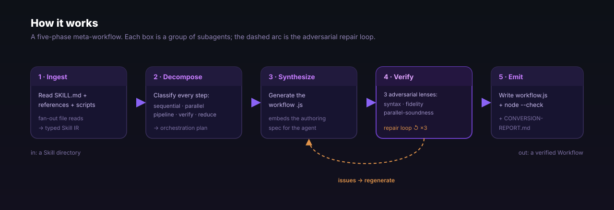

<div align="center">

# Architecture

**How the meta-workflow engine compiles a Skill into a Workflow.**

[](../LICENSE)
[](https://democra.ai)
[](https://code.claude.com/docs/en/workflows)
[](https://github.com/democra-ai/claude-workflow-viz)

</div>



The engine is itself a Workflow — [`workflows/skill-to-workflow.js`](../workflows/skill-to-workflow.js).
It reads a Skill (one agent following a procedure top-to-bottom in a single
context window) and emits a Workflow (deterministic JavaScript orchestration of
many subagents). The hard part is not translation but **recovery**: a skill's
dependency graph lives in its prose, and the engine has to make it executable —
then add three things a single-context skill cannot express: parallelisation,
adversarial verification, and typed (JSON-Schema) hand-offs.

For the *conceptual* model — why a sequential skill can become parallel and what
maps to what — see [./CONVERSION-MODEL.md](./CONVERSION-MODEL.md). This document
is the *mechanical* one: the five phases, the primitive each uses, the typed
object each produces.

## The five phases

The engine runs as five `phase()`-marked stages. Each consumes the typed object
the previous stage produced and emits its own. Every hand-off is a
JSON-Schema-validated object passed via `agent(..., { schema })`, so a malformed
result fails at the boundary instead of corrupting a later stage.

```
Ingest  ──► Decompose ──► Synthesize ──► Verify ──► Emit
Skill IR     plan           synth         verdict[]   emit
```

The script obeys the same hard constraints it generates *for*: plain JS, no
`Date.now()` / `Math.random()` / arg-less `new Date()` (they throw — they would
break workflow resume), no filesystem or Node APIs in the body (only the spawned
agents do I/O), and it ends by returning a summary object.

### 1. Ingest — build the Skill IR

**What it does.** Resolves the skill from `args.skillPath` (an absolute directory)
or `args.skillName` (looked up under `~/.claude/skills/<name>`, symlinks resolved),
reads `SKILL.md` — frontmatter `name` + `description`, plus the entire Markdown
body verbatim — and inventories every other file under the skill directory,
classifying each as `reference` / `script` / `asset` / `example` / `other` with
its absolute path and byte size. If nothing resolves it returns `resolved:false`
with an `error`, and the workflow exits early.

**Primitive: fan-out parallel reads.** A first `agent()` builds the inventory
(typed by `SKILL_IR_SCHEMA`) **without** reading file bodies. Then the engine
filters to the files worth deep-reading — `reference`, `script`, `example` (assets
are skipped) — and fans those reads out with `parallel(...)`, one reader agent per
file, so a large `references/` doc never serialises behind the others. The barrier
result is `.filter(Boolean)`-ed per the spec, then folded into a `digestBlock`
string the later phases embed.

**Produces: `Skill IR`** (`SKILL_IR_SCHEMA`) plus a list of per-file digests
(`FILE_DIGEST_SCHEMA`: `path`, `role`, `digest`, `referencedBySteps`).

### 2. Decompose — classify into an orchestration plan

**What it does.** A single planner agent reads the skill body (and the digest
block) and breaks the procedure into ordered steps, classifying **each step** into
one of five execution modes — recovering the dependency graph the skill left
implicit in reading order. The prompt pushes hard to find work that can be fanned
out and, especially, claims that deserve an adversarial check (most skills written
as single-agent advice have none).

**Primitive: one structured planner call.** This phase is deliberately a single
`agent()` with a schema — the plan is a global judgement about data flow, so
splitting it would lose the cross-step view it needs. The five `kind`s:
`sequential` (order-dependent), `parallel` (independent — fan out), `pipeline-stage`
(per-item transform, `perItem:true`), `verify` (adversarial check of a prior
result), `reduce` (merges / dedups / counts **all** prior results — needs a
barrier). Every `parallel`/`verify` choice must be justified in `rationale`.

**Produces: `plan`** (`PLAN_SCHEMA`) — `suggestedName`, `summary`, ordered `steps[]`
(`{id, description, kind, perItem, dependsOn[], needsSchema, rationale}`), the
`phases[]` the workflow will use, `inputs`, `parallelismNotes`, `verificationNotes`.

### 3. Synthesize — generate the workflow `.js`

**What it does.** Generates the runnable workflow file from the plan, re-expressing
each step with the right primitive: independent steps fan out with `parallel()`,
per-item steps become `pipeline()` stages, `verify` steps become adversarial agents,
`reduce` steps get a barrier feeding a single reducer. It preserves the skill's
domain rules, thresholds and wording inside the agent prompts, embeds reference
content inline where the skill leans on it, and has agents invoke bundled scripts
via `Bash` where the skill ran one.

**Primitive: one synthesis call with the embedded spec.** The agent receives the
Skill IR body, the digest block, the full plan, and — critically — the embedded
**authoring spec** (see below). It must start the file with the pure-literal
`export const meta = { name, description, phases }`, give every cross-stage hand-off
a schema, end with a `return` summary, and output the whole file.

**Produces: `synth`** (`SYNTH_SCHEMA`) — `{filename, script, rationale}`.

### 4. Verify — three adversarial lenses + repair loop

**What it does.** Reviews the synthesized code through three independent lenses,
collects every issue, and if any is `blocker`/`major`, repairs and re-reviews —
looping up to `MAX_ROUNDS` (3).

**Primitive: the repair `while` loop with 3 parallel lenses.** Inside each round
the three lenses (the `LENSES` array) run concurrently via `parallel(...)`:

- **`syntax`** — mechanical correctness against the spec: pure-literal `meta`,
  `phase()` titles matching `meta.phases`, no `Date.now`/`Math.random`/`new Date`,
  plain JS, `.filter(Boolean)` after every barrier, pipeline-vs-parallel used per
  the rules, a schema on every machine-read hand-off, a returned value, no imports
  of the globals.
- **`fidelity`** — does the workflow do *everything* the skill does? Walk the
  procedure step by step; flag any dropped step, lost threshold/rule, or changed
  behaviour. Adding capability is fine; losing it is not.
- **`parallel`** — soundness of every `parallel()`/`pipeline()`: flag false
  parallelism (fanned-out steps that share a dependency), unjustified barriers (a
  `parallel()` that should be a `pipeline()`), missing `.filter(Boolean)`, and
  missed parallelisation (a per-item skill written as one agent call).

The verdicts are flattened; `blocker`/`major` issues are JSON-encoded and fed to a
repair agent that returns a corrected `{filename, script}` (same `SYNTH_SCHEMA`),
which becomes the next round's input. The loop `break`s the instant a round
produces zero blocking issues, so a clean first pass costs one round, not three.

**Produces: `verdict[]`** (`VERDICT_SCHEMA`) — one `{lens, pass, issues[]}` per lens
per round; each issue is `{severity∈blocker|major|minor, where, problem, fix}`.

### 5. Emit — write, check, report

**What it does.** Hands the final code to an agent that writes it to
`outDir || skillDir` (filename from synth/repair), runs `node --check` on the
written file, and writes a `CONVERSION-REPORT.md` beside it explaining the source
skill, how the procedure was decomposed, what was parallelised vs pipelined, the
adversarial verification added, the verify outcome, and how to run the result.

**Primitive: one emit agent (the only real I/O).** Per the hard constraints the
script body touches no filesystem — all disk work happens inside this spawned agent.

**Produces: `emit`** (`EMIT_SCHEMA`) — `{workflowPath, reportPath, syntaxOk, note}`.
The workflow's own return value summarises the run:
`{ok, skill, outputWorkflow, conversionReport, syntaxOk, verifyRounds, passedAllLenses, steps}`.

## Why the engine embeds its own spec

A subagent spawned by `agent()` does **not** carry the Workflow tool description.
It has no built-in knowledge of the target format — the allowed globals, the
pure-literal `meta` export, the `Date.now()`/`Math.random()` ban, the
`parallel()`-is-a-barrier rule. If the engine just asked "write a workflow," each
agent would invent its own dialect.

So the engine ships its own copy: a `WORKFLOW_SPEC` string constant defined once at
the top of the file, then embedded verbatim into the prompts of every agent that
writes or reviews workflow code — the **Decompose** planner (plan toward real
primitives), the **Synthesize** agent (the contract to build to), the three
**Verify** lenses (the contract to check against), and the **repair** agent (the
contract to fix toward). One source of truth for the format, travelling *with* the
prompt because nothing else carries it.

## Schemas

The typed hand-offs, all defined as JSON Schema constants near the top of the file:

| Schema | Phase | Carries |
|---|---|---|
| `SKILL_IR_SCHEMA` | Ingest | `resolved`, `skillDir`, `name`, `description`, `body` (verbatim), `files[]` (`{path, kind, bytes}`), `error`. |
| `FILE_DIGEST_SCHEMA` | Ingest | per bundled file: `path`, `role`, `digest`, `referencedBySteps` — what it contributes and which steps use it. |
| `PLAN_SCHEMA` | Decompose | `suggestedName`, `summary`, `steps[]` (`{id, description, kind, perItem, dependsOn[], needsSchema, rationale}`), `phases[]`, `inputs`, `parallelismNotes`, `verificationNotes`. |
| `SYNTH_SCHEMA` | Synthesize / repair | `{filename, script, rationale}` — the complete workflow source and a note on the orchestration choices. |
| `VERDICT_SCHEMA` | Verify | `{lens, pass, issues[]}` where each issue is `{severity, where, problem, fix}` — one adversarial review. |
| `EMIT_SCHEMA` | Emit | `{workflowPath, reportPath, syntaxOk, note}` — where files landed and whether `node --check` passed. |

Ingest also uses a tiny inline array schema for the resource file list that drives
the fan-out.

## Extending

The engine is data-driven where it counts, so common extensions are local edits:

- **Add a 4th verification lens.** Append an entry to the `LENSES` array in the
  Verify phase — `{key, prompt}`. The repair loop already fans out over `LENSES`
  with `parallel(...)` and feeds every `blocker`/`major` issue to the repair agent,
  so a new lens (e.g. *cost-soundness*: flag unbounded fan-out against `budget`, or
  *resume-safety*: catch nondeterminism the syntax lens missed) needs no loop
  changes. Keep the `prompt` concrete and end it with the strict pass rule — it is
  the entire instruction the lens gets.
- **Add a step kind.** Extend the `kind` enum in `PLAN_SCHEMA`, name it in the
  Decompose planner prompt, and teach the Synthesize prompt which primitive it maps
  to. Then add a `fidelity`/`parallel` check so Verify enforces the mapping.
- **Tune the repair budget.** `MAX_ROUNDS` bounds the Verify `while` loop; raise it
  for gnarly skills, lower it to fail faster.

## Related

- [./CONVERSION-MODEL.md](./CONVERSION-MODEL.md) — the conceptual model: two
  execution models for one procedure, the mapping rules, the three upgrades.
- [claude-workflow-viz](https://github.com/democra-ai/claude-workflow-viz) — the
  sibling project; it **visualises the very workflows this engine generates**.

---

<div align="center">

MIT © [democra.ai](https://democra.ai) · an independent community project, **not
affiliated with or endorsed by Anthropic**.

</div>
